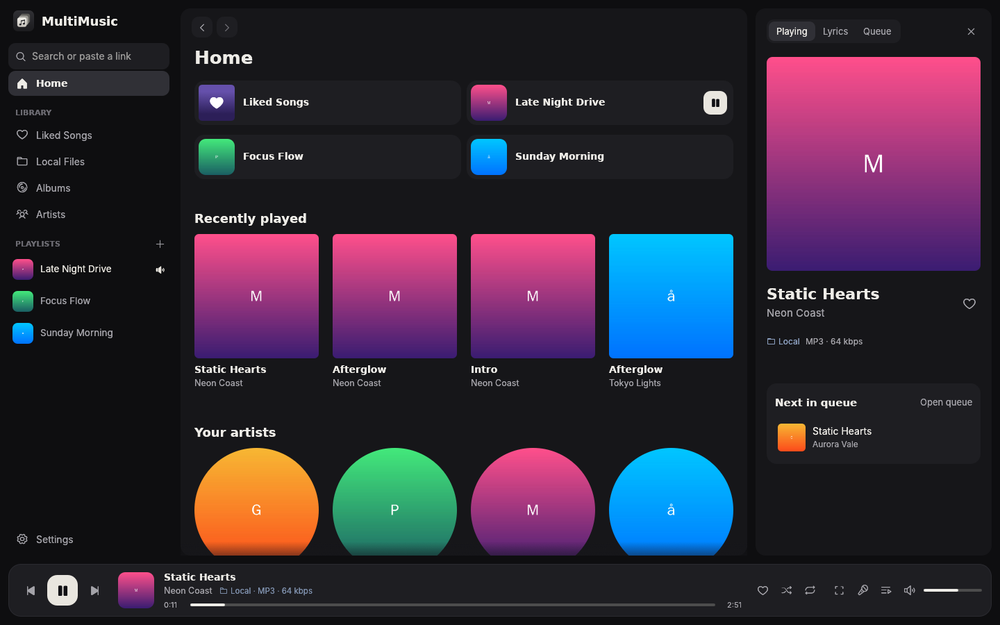
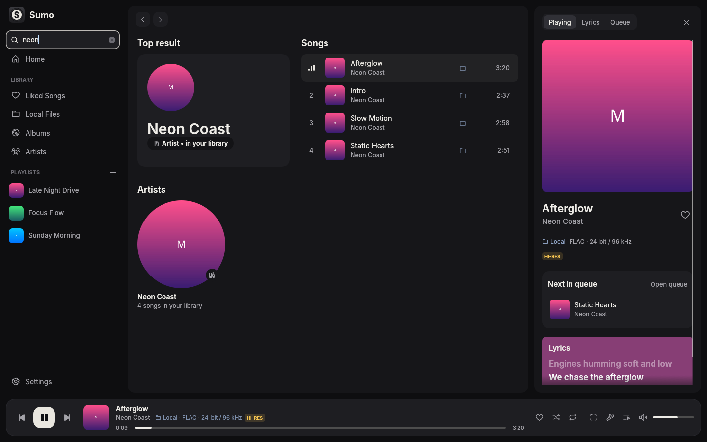
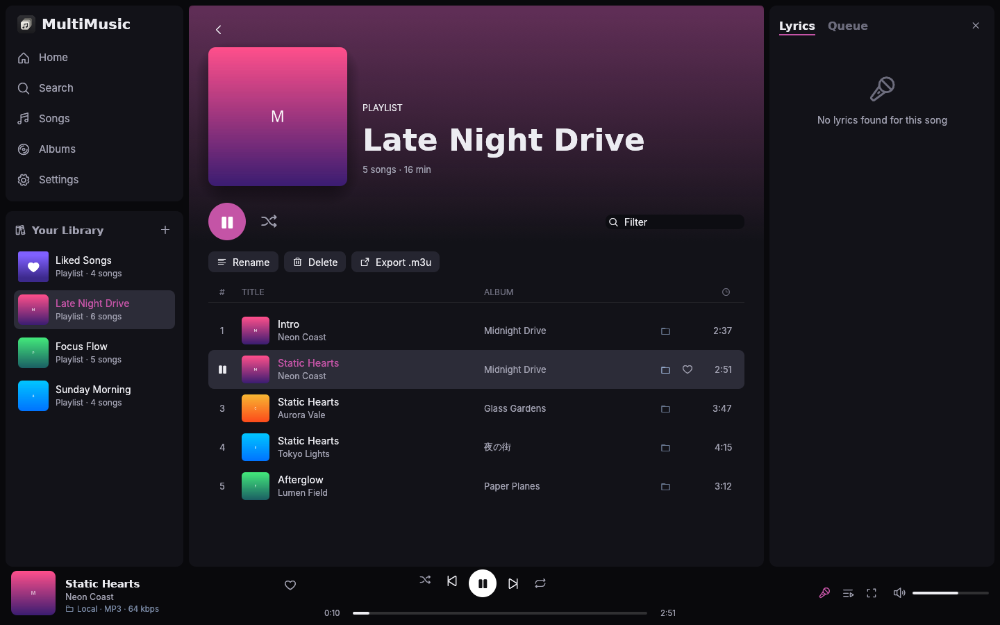
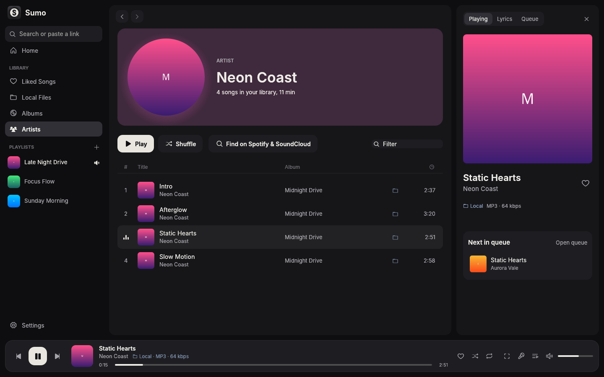
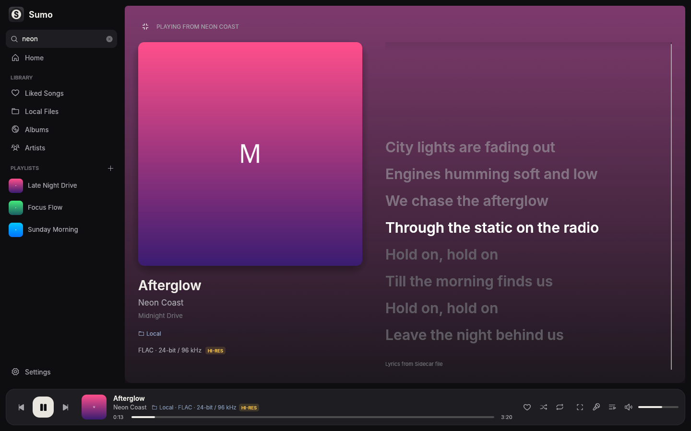

<p align="center"></p>

# MultiMusic

A fast, lightweight, native music player for **Windows, macOS and Arch Linux** that puts **your local files, Spotify, SoundCloud and your Apple Music library** in one place, with **synced lyrics**, **Discord Rich Presence**, **Last.fm scrobbling** and media-key / MPRIS support.

It's written in Rust with [egui](https://github.com/emilk/egui), like [Spotifast](https://spotifast.rocks/). There's no Electron and no web view, so it starts instantly and stays small in memory.



| Search (songs + artists everywhere) | Playlist |
| --- | --- |
|  |  |
| **Artist page** | **Full-screen lyrics** |
|  |  |

## Features

- **One library for every source**
  - **Local files**: MP3, FLAC, Opus, OGG, M4A/ALAC, WAV, AIFF, APE, WavPack and more. Tags and embedded or folder cover art are read automatically, and rescans are incremental. **Edit a file's details** (title, artist, album, album artist, genre, year, track and disc numbers, lyrics and cover) from its right-click menu (*Edit details…*), for one song or many at once; *Look up on Spotify* fills them in from Spotify, and a cover can come from an image file, a link or an image dropped on the window. Untagged files get their artist, title and track number from the file name (`Artist - Title.mp3`, `01 - Artist - Title [Free DL].mp3`, `artist_-_title.opus`, yt-dlp's `Title [id].opus`) and their artist and album from folders like `Artist/Album/` or `Artist - Album (2019)/`. Tags always win.
  - **Spotify**: imports all your playlists and Liked Songs and plays them in the app through [librespot](https://github.com/librespot-org/librespot) (Spotify Premium is needed for playback). Gapless playback, 96/160/320 kbps, volume normalisation.
  - **SoundCloud**: imports your likes and playlists (your own and liked ones), searches the catalogue and plays streams.
  - **Apple Music**: imports your library and playlists from a `Library.xml` export or the Apple Music API. Apple Music streams are DRM-protected and can't play on Linux, so each song plays from a matching local file, Spotify track or SoundCloud upload. MultiMusic finds the match automatically and remembers it.
  - **M3U/M3U8** playlist import and export.
- **Search everything at once**: one search box finds songs *and* artists in your library, on Spotify and on SoundCloud (artist profiles included, so small SoundCloud artists show up too). Results appear per service as soon as each one answers, Spotify and SoundCloud artists first; press **Enter** on an artist's exact name to jump straight to their page.
- **Artist pages and links**: click any artist name to see all their songs in your library, or open their Spotify / SoundCloud / Apple Music page. Artist pages bring Spotify and SoundCloud together: a Spotify artist also shows their SoundCloud uploads, a SoundCloud profile also shows their Spotify releases, and a library artist gets a *More on Spotify & SoundCloud* section. The same song is shown once (a single that is also on an album, or a song on both services), while remixes, live and slowed versions stay. Profiles are matched by exact name only, so you never get someone else's songs. **Paste a link** into the search box to open it, e.g. `https://open.spotify.com/artist/…`, `https://soundcloud.com/someone`, a SoundCloud set, `https://music.apple.com/…/album/…`, a `spotify:` URI, or a `spotify.link` / `on.soundcloud.com` short link. Any page can be saved as a MultiMusic playlist.
- **Custom playlists that mix sources**: drop a Spotify song, a SoundCloud upload and a FLAC into the same playlist. **Copy and paste songs** between lists: in any song list (a Spotify or SoundCloud playlist, an album, search results) press **Ctrl+A** (or Ctrl/Shift-click songs) and **Ctrl+C**, open one of your playlists and press **Ctrl+V**. Pasting Spotify or SoundCloud links (songs, albums or playlists, e.g. copied in the Spotify app) or music files from a file manager works too. In your playlists, **Delete** removes the selected songs and **Ctrl+X** cuts them. A cross-source **Liked Songs** collection (♥) also syncs likes back to Spotify and Last.fm.
- **Synced lyrics**: reads `.lrc` files next to your music, then embedded lyrics tags, then [LRCLIB](https://lrclib.net), and finally [Genius](https://genius.com) (plain lyrics) for songs LRCLIB doesn't have. Lyrics are shown in a side panel and in a full-screen *Now playing* view with a large cover. Click a line to jump to it.
- **Discord Rich Presence** shows "Listening to <song>" with the album cover, a progress bar and an "Open in Spotify/SoundCloud" button. Works with the Discord app, Vesktop and arRPC.
- **Crossfade** (Settings → Playback, up to 12 s) between any two sources: local file into Spotify, Spotify into SoundCloud, Spotify into Spotify, and so on. The next song starts on a second player while the current one fades out. Songs of the same album stay gapless unless you tick *Also crossfade between songs of the same album*. Skipping, seeking or pausing during a fade ends it right away.
- **Downloads from every service**: right-click a song and choose *Download*, use the download button on a playlist, album, artist or profile page, or the one next to the song in *Now playing*.
  - **SoundCloud** songs download directly: the uploader's original file when they allow it (often WAV or FLAC), otherwise the stream SoundCloud plays.
  - **Spotify and Apple Music** audio is DRM-protected, so MultiMusic does what [spotDL](https://github.com/spotDL/spotify-downloader) does: it finds the same recording on YouTube (the artist's official "Topic" upload, with the same length) through [yt-dlp](https://github.com/yt-dlp/yt-dlp), or on SoundCloud, and downloads that. Spotify's own encrypted audio is never touched. Install yt-dlp for this (`sudo pacman -S yt-dlp`); without it only SoundCloud is searched. Downloads take the highest-bitrate audio YouTube has: ~160 kbps Opus, or 256 kbps AAC with a YouTube Music Premium login (add `--cookies-from-browser firefox` under *Extra yt-dlp options*). Tick *Save YouTube downloads as MP3* if your devices don't play Opus (converting can't add quality). Spotify's own audio can't be saved: it is DRM-protected, and tools that decrypt it (like zotify) break Spotify's terms and get accounts banned.
  - **Full metadata**: every file is tagged with title, all artists, album, album artist, track and disc number (with totals), release date, ISRC, label, copyright, genre (SoundCloud), a link to the song and the full-size cover. For Spotify songs these come from Spotify itself. Lyrics from LRCLIB (time-synced when available) or Genius are embedded too. SoundCloud uploads get their "Artist - Title" names cleaned up and the album and release date from Genius.
  - Files are named "Artist - Title" and go to a *SoundCloud*, *Spotify* or *Apple Music* folder in your first library folder, so they also show up in *Local Files*; choose another folder under *Settings → Downloads*. Downloaded songs play from the file, even offline, and the **Downloads** page in the sidebar shows progress (cancel one song or all), failures (with *Try again*) and everything saved earlier. Unfinished downloads never land in your library: each one works in its own hidden folder until it is done.
- **Last.fm scrobbling**: by default every song scrobbles the moment it starts playing. Untick *Scrobble as soon as a song starts* to use Last.fm's usual rule instead (half the song or 4 minutes). Also sends "now playing" updates, and queues scrobbles offline to send later. SoundCloud uploads are scrobbled as the song they are: "Artist - Title [Free DL]" titles are cleaned up, Genius supplies the real artist, title and album (re-upload channels like "Nightcore …" get the original artist), and songs still without an album get the one Last.fm knows, so apps like .fmbot show the cover. Local files without tags are looked up on Spotify by their file name and scrobbled with Spotify's artist, title and album (or Last.fm's album instead of the folder's name). If Last.fm ignores a scrobble (e.g. a file tagged "Unknown Artist"), MultiMusic says why.
- **Your Last.fm profile**: once your account is connected, your profile picture and name sit at the bottom of the sidebar (click them for your stats; the gear next to them opens Settings), and Home ends with your week on Last.fm. The profile page shows your scrobbles, artists, albums, tracks and daily average, a **listening chart** (the last 7 or 30 days by day, the last 12 months by month, or every year since you joined), your **top artists, albums and tracks**, your **top genres** (from the tags on your top artists) and your **recent scrobbles**, including what's playing now and loved songs. Each section has its own menu: **Today, the last 7 or 30 days, 3, 6 or 12 months, or all time** (Last.fm has no "today", so MultiMusic counts the day's scrobbles itself). Click an artist to open them in your library (or search for them), and an album or song to search for it. The stats come from Last.fm with your API key; a profile with a private listening history can't be shown.
- **MPRIS / media keys**: works with `playerctl`, waybar, polybar, KDE/GNOME media widgets and headset buttons.
- **Its own look**: graphite and off-white like the logo, rounded "tile" panels, a floating player dock, header cards that glow in the colours of the cover, and soft hover and page transitions. **Drag the edges** of the sidebar and the lyrics / queue panel to resize them (sizes are remembered); drag the sidebar narrow and it becomes a strip of icons and covers. Also: a queue, back / forward navigation, albums and artists grids, gapless playback, ReplayGain, session restore, and drag and drop (drop a folder, `.m3u` or `Library.xml` onto the window). The accent colour can be changed in Settings.
- **Low memory use**: cover art is decoded at the size it's drawn and kept in a small LRU cache, fonts are memory-mapped from your system, and only two runtime threads are used. The window doesn't redraw at all while nothing changes.

## Install on Windows or macOS

Download the newest release from the [Releases page](https://github.com/simo1337s/localmusicplayer/releases):

- **Windows 10/11 (64-bit):** `MultiMusic-Setup-<version>-x64.exe`. It installs for your user (no administrator prompt), with everything MultiMusic needs: mpv for playback, yt-dlp and ffmpeg for downloads, and the Inter font. Start menu entry and an optional desktop shortcut included; uninstall from *Settings → Apps*. Your settings stay in `%APPDATA%\multimusic`.
- **macOS 11 or newer:** `MultiMusic-<version>-macos-arm64.dmg` for Apple Silicon (M1/M2/M3/M4) or `MultiMusic-<version>-macos-intel.dmg` for Intel Macs. Open it and drag MultiMusic to Applications; mpv, yt-dlp and ffmpeg are inside the app. MultiMusic isn't notarized by Apple (that needs a paid developer account), so the first time macOS asks: right-click MultiMusic → **Open** → **Open**, or *System Settings → Privacy & Security → Open Anyway*.

**Updates install themselves:** MultiMusic looks for a new release when it starts (and every few hours), shows a bar when one is out, and **Update now** downloads it, checks its SHA-256 checksum, installs it and starts the new version. Turn this off or check by hand under *Settings → Updates*. While the GitHub repository is private, updates need a GitHub token with read access there (*Settings → Updates*); once it's public, nothing is needed.

Moving from another computer? Export your settings there and import them here (see [Back up or move your settings](#back-up-or-move-your-settings)).

The installers are built by GitHub Actions ([`.github/workflows/release.yml`](.github/workflows/release.yml)) from this repository: the Windows installer with Inno Setup, the macOS apps for Apple Silicon and Intel. Releases come from the version in `Cargo.toml`.

## Install (Arch Linux)

```sh
sudo pacman -S --needed base-devel git rust mpv
git clone https://github.com/simo1337s/localmusicplayer.git
cd localmusicplayer
makepkg -si          # builds and installs the `multimusic` package
```

Then launch **MultiMusic** from your app launcher, or run `multimusic`.

Optional extras:

```sh
sudo pacman -S noto-fonts noto-fonts-cjk inter-font
```

- `noto-fonts-cjk`: Japanese, Chinese and Korean titles.
- `inter-font`: a nicer UI font. MultiMusic uses Inter, Noto Sans, Cantarell or DejaVu, whichever is installed.
- `noto-fonts` (or `ttf-dejavu`): symbols in names such as ☆ ✞ ♡ instead of empty boxes.

To run without packaging: `cargo build --release && ./target/release/multimusic`.

## Setting up your accounts

Everything is under **Settings** (bottom of the sidebar).

| Service | What to do |
| --- | --- |
| **Local files** | `~/Music` is scanned by default. Add more folders in Settings, or drag a folder onto the window. |
| **Spotify** | Click **Log in with Spotify**. Your browser opens Spotify's login page; approve it and your playlists and Liked Songs import automatically. The import goes through MultiMusic's own Spotify connection, so it isn't affected by Web API rate limits. Playback needs **Spotify Premium**. **Search** uses Spotify's Web API, whose shared key is often rate limited (HTTP 429). To fix that, create a free app at [developer.spotify.com](https://developer.spotify.com/dashboard) (tick *Web API*), then paste its **Client ID** and **Client secret** (app → Settings → *View client secret*) under *Settings → Spotify → Advanced*. That's all: no browser login and no Redirect URI. (Prefer a browser login to your app instead? Open *Or log in to your app in the browser*, add the Redirect URI shown there to your app, **Save**, and click **Authorize**.) |
| **SoundCloud** | Paste your profile URL (`https://soundcloud.com/you`) and click **Sync**. Private likes and playlists also need your `oauth_token` cookie from soundcloud.com (DevTools → Application → Cookies). |
| **Apple Music** | On a Mac or in iTunes on Windows: *File → Library → Export Library…*, then drop the `Library.xml` onto MultiMusic or paste its path. You can also paste your `media-user-token` cookie from music.apple.com and use *Import with the Apple Music API*. Songs play from local files, Spotify or SoundCloud. |
| **Last.fm** | Create an API account at [last.fm/api/account/create](https://www.last.fm/api/account/create), paste the key and secret, click **Connect account** and approve in the browser. |
| **Discord** | Create an application at [discord.com/developers/applications](https://discord.com/developers/applications) (call it "MultiMusic", or anything you like), and paste its **Application ID**. |

## Lossless & hi-res

- Local **FLAC, ALAC, WAV, AIFF, APE and WavPack** play at their native bit depth and sample rate. The player dock shows the format (e.g. `FLAC · 24-bit / 96 kHz`) with a **LOSSLESS** or **HI-RES** badge.
- **Settings → Playback → Output device** picks the exact output (e.g. your USB DAC). **Bit-perfect output** opens the device exclusively and skips ReplayGain. For true bit-perfect playback, choose an `alsa/hw:…` device, keep MultiMusic's volume at 100% and use your DAC or amp for volume.
- On **PipeWire**, everything is resampled to PipeWire's rate unless you let it switch rates. Create `~/.config/pipewire/pipewire.conf.d/10-rates.conf`:

  ```
  context.properties = {
      default.clock.allowed-rates = [ 44100 48000 88200 96000 176400 192000 ]
  }
  ```

  Then run `systemctl --user restart pipewire`.
- **Spotify lossless isn't possible.** Spotify only streams its FLAC files to the official Spotify apps, so librespot-based players (including MultiMusic) get 320 kbps Ogg Vorbis at most.

## Back up or move your settings

*Settings → Back up or move your settings* saves everything on the Settings page to one file (`MultiMusic settings <date>.json` in your Documents folder), optionally with your **keys and logins** (Last.fm, SoundCloud, Apple Music, Discord, your Spotify app keys, the Spotify login itself and the GitHub token for updates) and **your own playlists and Liked Songs**. On another computer (Linux, Windows or macOS) import it from the same section, or drop the file onto the window: MultiMusic takes the settings over, adds the playlists and restarts. Library and download folders that don't exist on the new computer, the mpv / yt-dlp programs and the audio device are left as they are there. A file with keys holds your passwords and tokens, so keep it private.

## Keyboard shortcuts

| Key | Action |
| --- | --- |
| `Space` | Play / pause |
| `←` / `→` | Seek −5 s / +5 s |
| `Ctrl+←` / `Ctrl+→` | Previous / next track |
| `↑` / `↓` | Volume up / down |
| `Ctrl+K`, `Ctrl+F` or `/` | Search (paste a link to open it) |
| `Alt+←` / `Alt+→`, mouse back / forward buttons | Back / forward |
| `L` | Toggle the full-screen *Now playing* / lyrics view |
| `Esc` | Leave the *Now playing* view, or let go of selected songs |
| `Ctrl+A` / `Ctrl+C` | Select every song in a list / copy the selected songs |
| `Ctrl+V` | Paste copied songs (or Spotify / SoundCloud links, or music files) into the open playlist |
| `Ctrl+X` / `Delete` | Cut / remove the selected songs from your playlist |
| `Ctrl+Q` | Quit |

Double-click a song to play it. Ctrl-click or Shift-click songs to select several. Click an artist name to open the artist. Right-click a song for *Play next*, *Add to queue*, *Add to playlist*, *Like* and *Open in Spotify / Show in folder*. Drag the sidebar or the right panel by its edge to resize it; drag the sidebar narrow (or click the logo) for the compact icons-and-covers strip.

## Memory use

I measured this in a VM while a local song was playing, with the album view and lyrics open:

| Process | Resident memory |
| --- | --- |
| `multimusic` | ~152 MB in total, but most of that is the VM's *software* OpenGL renderer (llvmpipe: about 66 MB of libraries plus its frame buffers on the heap). With a real GPU that work moves to the graphics driver; I haven't measured it on real hardware. MultiMusic's own heap is under 15 MB. |
| `mpv` (playback of local files & SoundCloud) | ~54 MB RSS, of which only ~13 MB is private; the rest is shared ffmpeg libraries. It only runs while you play local files or SoundCloud. |

In the same VM and scenario, the version before these memory changes used ~197 MB; most of the saving holds on any machine:

- glibc's allocator is limited to two arenas and hands large freed blocks straight back (`mallopt`), and freed memory is returned after scans, syncs and every 30 s while the window is active (`malloc_trim`).
- egui's glyph atlas is capped at 2048 px wide instead of the GPU's maximum (often 16384 px), where one big cover letter reserved a whole 16384 px row: 2 MiB instead of 8 MiB, in RAM and on the GPU.
- Covers are shrunk straight from a cropped view of the decoded image, without two more full-size copies (a 3000 px cover used to take ~90 MB for a moment).

Spotify playback runs inside the MultiMusic process (librespot) and doesn't start another process. The official Spotify client usually uses 400–800 MB.

To keep memory low: lower *Covers kept in memory* in Settings → Appearance, and close the lyrics panel (it repaints 10× per second while playing, compared with twice per second otherwise).

## Files

| What | Linux | Windows | macOS |
| --- | --- | --- | --- |
| Settings (`config.toml`, also editable by hand) | `~/.config/multimusic/` | `%APPDATA%\multimusic\config\` | `~/Library/Application Support/multimusic/` |
| Library database, Spotify login, scrobble queue, log | `~/.local/share/multimusic/` | `%APPDATA%\multimusic\data\` | `~/Library/Application Support/multimusic/` |
| Cover art and lyrics cache | `~/.cache/multimusic/` | `%LOCALAPPDATA%\multimusic\cache\` | `~/Library/Caches/multimusic/` |

Logs: on Linux run `MULTIMUSIC_LOG=multimusic=debug multimusic` in a terminal. The Windows and macOS apps write `multimusic.log` in the data folder (set `MULTIMUSIC_LOG=multimusic=debug` for more detail).

## Troubleshooting

- **No sound from Spotify**: Spotify plays through PipeWire/PulseAudio (`pipewire-pulse`) and follows your default output device. If you use plain ALSA without a sound server, set *Settings → Spotify → Audio output* to ALSA.
- **Spotify login says "redirect_uri: Not matching configuration"**: the *Redirect URI* in *Settings → Spotify → Advanced* and one of the Redirect URIs in your app on developer.spotify.com must be identical, character for character. Either add MultiMusic's (`http://127.0.0.1:8899/login` by default) to your app, under Settings → Edit → Redirect URIs → Add, then **Save** at the bottom; or paste the one your app already lists into MultiMusic. Use `127.0.0.1`, not `localhost` (Spotify rejects `localhost`). Put your app's ID in *Your own Spotify app → Client ID*, not in *Login client ID*. Use `http://`, not `https://` (Spotify only wants https for internet addresses). MultiMusic asks Spotify before opening the browser, uses the form of the URI your app has saved (e.g. with a trailing slash), and otherwise says what's missing. Easiest of all: paste your app's **Client secret** instead, which needs no Redirect URI. A login you abandon times out after 5 minutes; clicking Log in / Authorize again restarts it right away.
- **Upgrading from Medley**: your settings, library and logins move to the new `multimusic` folders automatically on first start.
- **Spotify "HTTP 429 Too Many Requests"** or **"rate limited" under Spotify in search**: that's the shared Web API key being rate limited. Library import and playback don't use it. For search, add your own Spotify app (see *Setting up your accounts*); search now says so right away instead of spinning.
- **Boxes (□) in song or artist names**: install `noto-fonts` (or `ttf-dejavu`) for symbol characters, and `noto-fonts-cjk` for Japanese, Chinese and Korean.
- **Crossfade does nothing**: it's off in bit-perfect mode and with `alsa/hw:` output devices, because those can't be opened twice at the same time.
- **Spotify says Premium is required**: playlists and search work on free accounts, but librespot can only stream with Premium.
- **A pasted Spotify link says "Log in to Spotify"**: Spotify pages load through your Spotify login, so log in under Settings first. SoundCloud and Apple Music links work without an account.
- **`makepkg` fails in `check()`**: update to the latest commit (`git pull`); an older test could fail when a network port was busy. `makepkg -si --nocheck` skips the tests.
- **Some SoundCloud tracks won't play**: SoundCloud Go+ tracks only offer 30-second previews to third-party apps, and some tracks are region-locked.
- **A Spotify or Apple Music download says "install yt-dlp"**: these songs are found on YouTube with yt-dlp (`sudo pacman -S yt-dlp`), which also needs `ffmpeg` (already installed with mpv). Without yt-dlp only SoundCloud is searched, where many songs are missing or only have Go+ previews. If YouTube downloads start failing, update yt-dlp; YouTube changes often. *Settings → Downloads* shows whether yt-dlp was found.
- **YouTube says "Sign in to confirm you're not a bot"**: put `--cookies-from-browser firefox` (or `chrome`, `brave`, …) in *Settings → Downloads → Extra yt-dlp options*, so yt-dlp uses your browser's YouTube login.
- **A SoundCloud download fails**: Go+ songs only offer a 30 second preview or an encrypted stream, and neither is saved. Region-locked songs fail too. Other failures can be retried from the Downloads page.
- **Why not save Spotify's own audio?** It is encrypted (DRM). Tools that decrypt it break Spotify's terms and get accounts banned, so MultiMusic downloads the same recording from YouTube or SoundCloud instead and tags it with Spotify's details.
- **Japanese/Korean/Chinese text shows boxes**: install `noto-fonts-cjk`. MultiMusic loads a CJK font only when your library needs it.
- **Media keys don't work**: on Linux MultiMusic registers as `org.mpris.MediaPlayer2.multimusic`; check with `playerctl -l`. It needs a D-Bus session, which every normal desktop session has. Windows (media overlay and keys) and macOS (Now Playing and keys) need nothing.
- **macOS says MultiMusic "can't be opened" or "is damaged"**: it isn't notarized by Apple. Right-click it → Open → Open once, or run `xattr -dr com.apple.quarantine /Applications/MultiMusic.app` in Terminal.
- **Windows: the window stays black or MultiMusic closes right away**: MultiMusic draws with OpenGL; update your graphics driver. Remote Desktop sessions and virtual machines without a graphics driver only offer OpenGL 1.1, which is too old. `%APPDATA%\multimusic\data\multimusic.log` says what went wrong.
- **An update doesn't install**: *Settings → Updates* shows why. While the repository is private, the update check needs a GitHub token there. You can always download the newest version from the Releases page and install it over the old one; settings are kept.
- **Interface too small or too large**: Settings → Appearance → *Interface scale*.

## How it works

```
src/
  main.rs              window + runtime setup
  service.rs           background service: playback state machine, sync jobs, search, pages, integrations
  links.rs             recognises pasted Spotify / SoundCloud / Apple Music links
  downloader.rs        downloads: finds the audio, then tags it with metadata, cover and lyrics
  player/              play queue, mpv (JSON IPC) engine, librespot engine + Spotify OAuth
  library/             SQLite store, incremental tag scanner and tag writer (lofty), M3U import/export
  providers/           Spotify (session + Web API), SoundCloud api-v2, Apple Music (XML + catalog API), YouTube (yt-dlp)
  integrations/        lyrics (LRC/LRCLIB/Genius), Genius song details, Last.fm (scrobbling, profile stats),
                       Discord RPC, MPRIS
  ui/                  egui views, theme, widgets, cover art cache
```

The UI thread only draws. Playback, network and disk work run on a small tokio runtime and publish snapshots that the UI reads each frame.

## Disclaimer

MultiMusic is an unofficial client and isn't affiliated with Spotify, SoundCloud, YouTube, Apple or Discord. Spotify support uses librespot. Use the integrations in line with each service's terms.

## License

MIT
